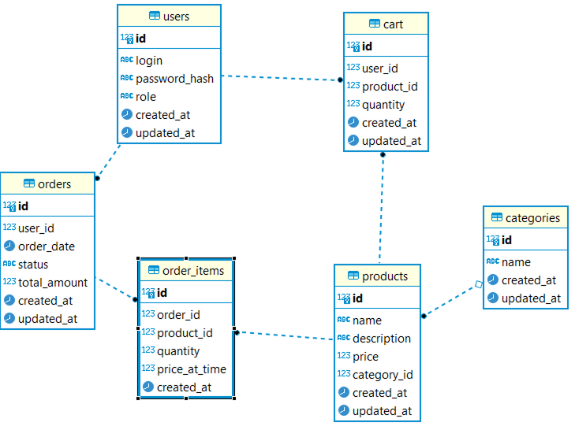

# Выпускная работа ЦК Java «Интернет-магазин»

## Назначение проекта

Веб-приложение для интернет-торговли, позволяющее пользователям:
- просматривать каталог товаров с фильтрацией по категориям;
- добавлять товары в корзину и управлять корзиной;
- оформлять заказы;
- просматривать историю заказов и детали каждого заказа.

---

## Демонстрация работы приложения

📹 [Смотреть видео демонстрацию на Google Drive](https://drive.google.com/file/d/12YPiRqkxIGYL26dKMcLVNKgsNYwm0u9Z/view?usp=sharing)

---

## Диаграмма базы данных



---

## SQL скрипт для создания базы данных

[Скачать SQL скрипт](./docs/db_table_creator.sql)

---

## Технические требования

| Компонент | Технология |
|-----------|------------|
| Язык программирования | Java 17 |
| База данных | PostgreSQL |
| Сборка проекта | Maven |
| Серверная часть | Servlet API (Jakarta Servlet 6.0) |
| Представления | JSP + JSTL |
| Клиентская часть | HTML, CSS |
| Архитектурный паттерн | MVC (DAO, Bean, Controller, JSP) |
| Контейнер сервлетов | Apache Tomcat 10.1 |

---

## Функциональные возможности

### 👤 Пользователи
- Регистрация нового пользователя
- Авторизация (вход/выход)
- Разграничение доступа: неавторизованные пользователи видят только страницы входа и регистрации

### 📦 Товары
- Просмотр списка всех товаров
- Фильтрация товаров по категориям
- Просмотр детальной информации о товаре

### 🛒 Корзина
- Добавление товаров в корзину с выбором количества
- Удаление товаров из корзины
- Просмотр корзины с подсчётом общей суммы

### 📋 Заказы
- Оформление заказа (перенос товаров из корзины в заказ)
- Транзакционность: заказ и очистка корзины выполняются атомарно
- Просмотр истории заказов
- Просмотр деталей заказа (товары, цены на момент заказа)

---

## Инструкция по запуску

### Предварительные требования

1. **Установите Java 17** или выше
2. **Установите PostgreSQL** (версия 14 или выше)
3. **Установите Apache Tomcat 10.1**
4. **Установите IntelliJ IDEA** (рекомендуется)

---

### Шаг 1: Клонирование проекта

```bash
git clone <repository-url>
cd mipt_java_exam
```

### Шаг 2: Настройка базы данных

1. **Создайте базу данных** в PostgreSQL:

```sql
CREATE DATABASE shop_db;
```
2. **Выполните SQL скрипт для создания таблиц и заполнения тестовыми данными:**

```sql
psql -U postgres -d shop_db -f docs/db_table_creator.sql
```

3. **Создайте файл .env в корне проекта:**

```
DB_HOST=localhost
DB_PORT=5432
DB_NAME=shop_db
DB_USER=postgres
DB_PASSWORD=your_password
```

### Шаг 3: Запуск через IntelliJ IDEA

1. **Откройте проект** в IDEA:
    - `File` → `Open` → выберите папку проекта или `pom.xml`

2. **Дождитесь загрузки Maven зависимостей**

3. **Настройте Tomcat:**
    - `Run` → `Edit Configurations`
    - Нажмите `+` → `Tomcat Server` → `Local`
    - Перейдите на вкладку `Deployment`
    - Нажмите `+` → `Artifact` → выберите `online-shop:war exploded`
    - Установите `Application context` = `/`
    - Нажмите `OK`

4. **Запустите Tomcat**

### Шаг 4: Доступ к приложению

Откройте браузер и перейдите по адресу:
http://localhost:8080